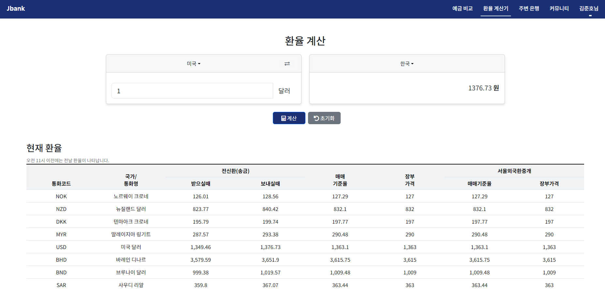
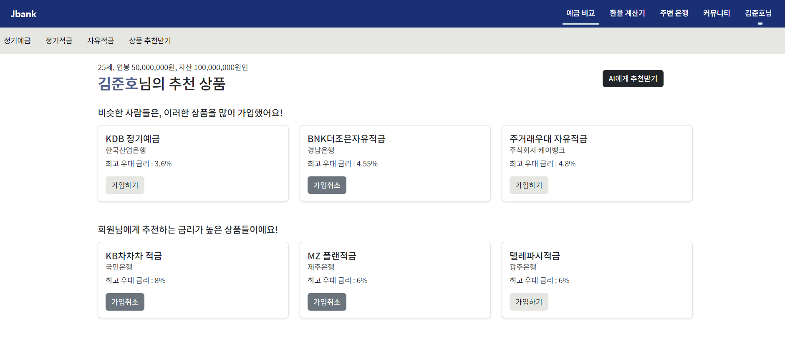

# PJT_10 : 금융 상품 비교 애플리케이션

## 기술 스택

- 사용 API
  - 한국수출입은행 환율정보 API
  - 카카오맵 API
  - 금융감독원 API
- 주요 라이브러리
  - Bootstrap
  - chartjs
  - Django REST Framework
- 개발 환경
  - Python 3.9.x
  - Django 4.2.x
  - Node.js 20.x
  - Vue 3 & Pinia
- 사용 아키텍처
  - Django & Vanilla JavaScript
  - Django REST Framework & Vue3

## 팀원 정보

- **김준호**: 백엔드 개발
  - API 연동
  - 데이터베이스 관리
  - 서버 배포 및 유지보수
  - 금융 상품 추천 알고리즘 개발
  -
- **김주연**: 프론트엔드 개발
  - ERD 작성
  - UI/UX 디자인
  - Vue.js 컴포넌트 개발
  - 사용자 인터페이스 구현

## ERD

[ERD page](https://www.erdcloud.com/p/iR7DzjWmcQcMrJtvX)

## 금융 상품 알고리즘 구현 방법

나이, 연봉, 자산을 기준으로 나이 ± 10살, 자산 ± 10,000,000원, 연봉 ± 10,000,000원을 만족하는 비슷한 유저들이 많이 가입한 상품 5개와, 금리가 높은 상품 5개를 추천해주었다.

## 아키텍처 및 실제 구현 정도

### 아키텍처

- **백엔드**: Django REST Framework
  - 금융 상품 데이터 API 연동
  - 사용자 관리 및 인증
  - 데이터베이스 연동 및 관리
- **프론트엔드**: Vue 3 & Pinia
  - 사용자 인터페이스 구현
  - 상태 관리
  - API 연동 및 데이터 처리

### 실제 구현 정도

- **예금 & 금리 비교**: 금융 상품 데이터 API를 통해 데이터를 수집하고, 사용자에게 예금, 금리 목록을 최대금리, 기본금리가 높은 순으로 제공합니다.
- **환율 계산기**: 한국수출입은행 환율정보 API를 통해 실시간 환율 정보를 제공하고, 원화와 외국 통화 간의 변환 기능을 구현했습니다.
- **은행 검색**: 카카오맵 API를 사용하여 사용자의 입력 위치와 은행명을 기준으로 주변 은행을 검색하는 기능을 구현했습니다.
- **상품 추천**: 사용자 데이터를 분석하여 맞춤형 금융 상품을 추천하는 알고리즘을 구현했습니다.
- **커뮤니티 기능**: 게시글과 댓글의 작성, 조회, 수정, 삭제 기능을 구현했습니다.
- **프로필 페이지**: 사용자 정보 및 가입한 금융 상품을 차트로 시각화하여 제공합니다.

## 주요 기능

### A. 메인 페이지

- 구현/기능

  - Carousel을 사용하여 서비스 소개
  - 현재 가입 회원들이 가장 많이 가입 한 상품 소개

- 구현화면

  - 

---

### B. 회원 커스터마이징

- 구현/기능

  - 회원 관리를 할 수 있는 기능(회원 가입, 로그인, 로그아웃 등)을 구성
  - 회원 모델을 커스텀하여 유저이름, 이메일, 나이, 연봉, 자산, 가입한 상품 목록도 유저 정보에 저장
  - 유저이름, 이메일, 나이, 연봉, 자산은 회원가입 페이지가 아닌 프로필 페이지에서 입력

- 구현화면

  - 
  - 

---

### C. 예적금 금리 비교

- 구현/기능

  - 금융상품통합비교공시 API를 통해 금융 상품 데이터를 수집
  - 수집한 데이터를 DB에 저장 후, 이미 DB에 존재하는 데이터는 새로 저장하지 않도록 구성
  - 전체 조회시, 은행 선택하여 목록 필터링
  - 최대금리, 기본금리 중 선택한 옵션으로 전체 목록 정렬
  - 특정 상품 클릭 시 상세 정보 조회
  - 상세 정보 페이지에서 [가입하기] 버튼을 추가하여, 클릭 시 해당 회원의 [가입한 상품 목록]에 상품 추가
  - 상세 정보 페이지에서 가입 기간에 따른 이자율 계산

- 구현화면

  - 
  - 
  - 
  - 

---

### D. 환율 계산기

- 구현/기능

  - 한국수출입은행 환율정보 API를 사용하여 실시간 환율 정보를 제공
  - 국가 선택 후 두 국가 간의 통화 변환 기능 구현
  - 환율 정보 DB에 저장 후, 오전 11시 이전 조회 시 전날 환율 정보 제공

- 구현화면

  - 

---

### E. 근처 은행 검색

- 구현/기능

  - 카카오맵 API를 사용하여 사용자가 검색하는 위치와 은행명 기반으로 주변 은행 정보를 제공
  - 검색 결과 선택 시 해당 은행의 위치로 지도가 이동

- 구현화면

  - 

---

### F. 커뮤니티(게시판)

- 구현/기능

  - 게시글 작성, 조회, 수정, 삭제 및 댓글 기능
  - Django의 모델과 뷰를 사용하여 게시판 기능을 구현
  - 게시글과 댓글의 작성자와 현재 유저가 다르면 수정 및 삭제 버튼 보이지 않음

- 구현화면

  - 
  - 
  - 
  - 

---

### G. 프로필 페이지

- 구현/기능

  - 사용자 정보 및 가입한 금융 상품 목록 제공
  - 사용자 정보 수정
  - 차트 라이브러리를 사용하여 가입한 상품의 금리 정보를 시각화하여 제공

- 구현화면

  - 
  - 
  - 

---

### H. 금융 상품 추천 알고리즘

- 구현/기능

  - 다른 회원들의 정보를 활용하기 위해 더미 데이터를 랜덤으로 생성
  - 비슷한 유저들이 많이 가입한 상품 5개와, 금리가 높은 상품 5개를 추천
  - 상품 추천받는 페이지에서도 상품 가입 가능

- 구현화면

  - 

### I. 생성형 AI (챗봇)

- 구현/기능

  - 챗봇을 이용하여 조건에 맞는 DB에 있는 상품 중 하나를 받을 수 있음

- 구현화면

  - 
  - 

---

### 후기

- 김준호 : 이번 프로젝트는 Django와 Django Rest Framework를 사용하여 은행 상품 추천 백엔드 서버를 개발하는 것이었습니다. 사용자 나이, 연봉, 자산을 기반으로 비슷한 사용자들이 가입한 상품을 추천하는 기능을 구현했습니다. 개발 과정에서 데이터 필터링, 성능 최적화, 인증 관리 등을 배웠습니다. 도전 과제는 필터링 조건 설정과 금리 정보 추출이었으며, 향후 기능 개선과 성능 최적화를 계획하고 있습니다. 이번 프로젝트를 통해 백엔드 개발의 전반적인 과정을 익힐 수 있었습니다.
- 김주연 : 싸피 들어와서 시작부터 끝까지 완성한 첫 프로젝트인데, 한 학기 배운 내용을 정리 할 수 있는 좋은 경험이였습니다. 프로젝트의 흐름이 어떻게 되는지 배우게 되었고, 처음부터 명세서를 확실하게 만들고 시작하는 것이 중요하고 정말 프로젝트라는 것은 소통이 중요하다는 것을 알게되었습니다. 기간이 너무 짧긴했지만 2학기 프로젝트를 할 수 있을 것 같다는 자신감이 생기게 되었습니다.
